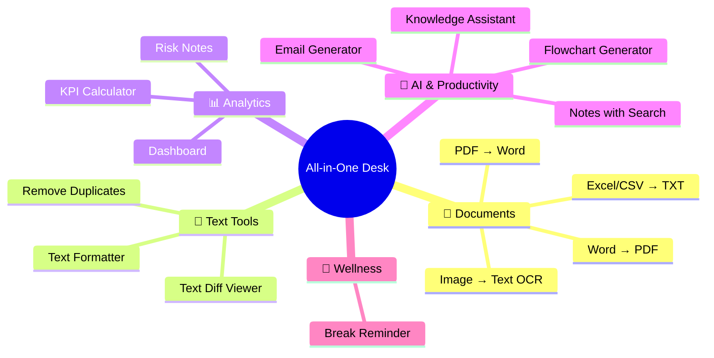
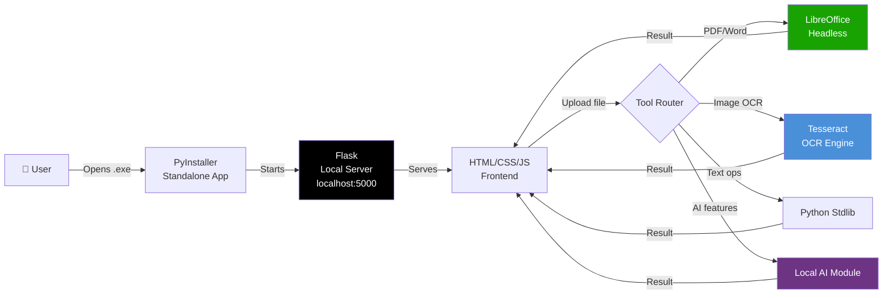
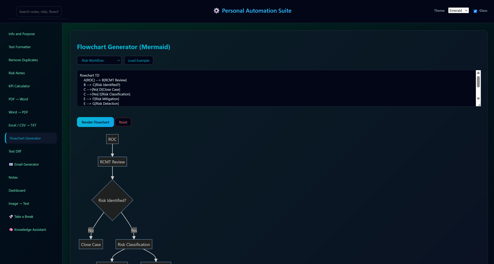
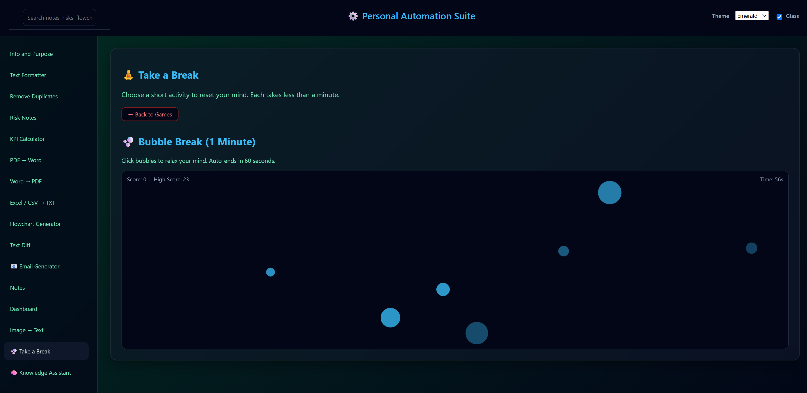

<div align="center">


### 15+ professional tools. Zero internet. One app.

[](https://python.org)
[](https://flask.palletsprojects.com/)
[](https://github.com/tesseract-ocr/tesseract)
[](https://www.libreoffice.org/)
[](https://pyinstaller.org/)

[](.)
[](.)
[](.)
[](.)

<br/>

```
╔══════════════════════════════════════════════════════════════╗
║  📄 Documents  ·  🔧 Text  ·  📊 Analytics  ·  🤖 AI  ·  🧘 Wellness  ║
║          Everything you need. Nothing leaves your machine.          ║
╚══════════════════════════════════════════════════════════════╝
```

</div>

---

## 🎯 What Is This?

**All-in-One Desk** is a self-contained desktop productivity application that packages **15+ professional tools** into a single offline interface — no subscriptions, no cloud uploads, no data leaks.

Built for professionals who handle **sensitive or confidential documents** and can't afford to pipe files through third-party cloud services. Everything runs locally via a lightweight Flask server, packaged into a standalone executable.

> Think: your own private Notion + Adobe Acrobat + Grammarly + AI assistant — but air-gapped.

---

## ✨ Features At a Glance



---

## 🗂️ Tool Breakdown

### 📝 Document Tools

<table>
<tr><td width="50%">

**PDF → Word** — Convert any PDF into a fully editable `.docx`

**Word → PDF** — Export Word docs to polished PDFs, no MS Office needed

</td><td width="50%">

**Excel / CSV → TXT** — Flatten spreadsheet data to plain text

**🔍 Image → Text (OCR)** — Extract text from screenshots via Tesseract

</td></tr>
</table>

### 🔧 Text Processing

<table>
<tr>
<td align="center" width="33%"><b>Text Formatter</b><br/>Clean messy text, fix encoding, normalize whitespace</td>
<td align="center" width="33%"><b>Remove Duplicates</b><br/>Deduplicate lists, emails, IDs instantly</td>
<td align="center" width="33%"><b>Text Diff</b><br/>Side-by-side visual diff between two texts</td>
</tr>
</table>

### 📊 Data & Analytics

<table>
<tr>
<td align="center" width="33%"><b>📈 KPI Calculator</b><br/>Feed raw numbers, get KPIs back</td>
<td align="center" width="33%"><b>📊 Dashboard</b><br/>Interactive charts from local data</td>
<td align="center" width="33%"><b>📋 Risk Notes</b><br/>Structured risk docs with search</td>
</tr>
</table>

### 🤖 Productivity & AI

<table>
<tr><td width="50%">

**✉️ Email Generator** — Professional emails from context templates

**🔀 Flowchart Generator** — Plain English → diagram

</td><td width="50%">

**🧠 Knowledge Assistant** — AI Q&A, no internet required

**📝 Notes** — Persistent notes with full-text search

</td></tr>
</table>

---

## 🔐 Security Architecture

```
┌──────────────────────────────────────────────────────┐
│                    YOUR MACHINE                       │
│  ┌────────────┐    ┌──────────────┐    ┌──────────┐  │
│  │  Your File │───▶│  All-in-One  │───▶│  Output  │  │
│  │  (Input)   │    │     Desk     │    │  (Local) │  │
│  └────────────┘    └──────────────┘    └──────────┘  │
│                 ❌ No Internet  ❌ No Cloud           │
│                 ❌ No API Keys  ✅ 100% Offline       │
└──────────────────────────────────────────────────────┘
```

---

## 🛠️ Tech Stack



| Layer | Technology | Role |
|:---:|:---:|:---|
| 🐍 Backend | Python + Flask | Routes, file processing |
| 🎨 Frontend | HTML + CSS + JS | Emerald/Glass UI |
| 🔍 OCR | Tesseract | Image-to-text |
| 📄 Documents | LibreOffice headless | PDF↔Word, no MS Office |
| 📦 Packaging | PyInstaller | Single `.exe` |

---

## 🚀 Getting Started

```bash
git clone https://github.com/Jeevan-0508/All-in-one-desk.git
cd All-in-one-desk
python -m venv buildenv
buildenv\Scripts\activate
pip install -r requirements.txt
python app.py
# Open http://localhost:5000
```

**Build standalone `.exe`:**
```bash
pyinstaller app.spec
```

---

## 🎨 Themes

| 🌿 Emerald | 🪟 Glass |
|:---:|:---:|
| Teal accents, dark interface | Frosted transparency effects |

---


## 📸 Screenshots

| Flowchart Generator | Take a Break |
|:---:|:---:|
|  |  |
| *Mermaid-powered diagrams — type plain text, render instantly* | *Built-in Bubble Break wellness game to reset your focus* |

---

## 💡 Skills Demonstrated

| Skill | Detail |
|:---|:---|
| 🐍 Python / Flask | REST API, file handling, subprocess management |
| 📦 App Packaging | PyInstaller with binary deps (Tesseract, LibreOffice) |
| 🔍 OCR Integration | Tesseract engine configuration, image pipeline |
| 🔒 Privacy-First Design | Offline architecture, zero data egress |
| 🧠 Product Thinking | Unified 15-tool suite replacing cloud dependencies |

---

<div align="center">

**Built by [Jeevan Kumar](https://github.com/Jeevan-0508)**

*Work smarter, not harder — and keep your data safe while doing it.*

</div>
